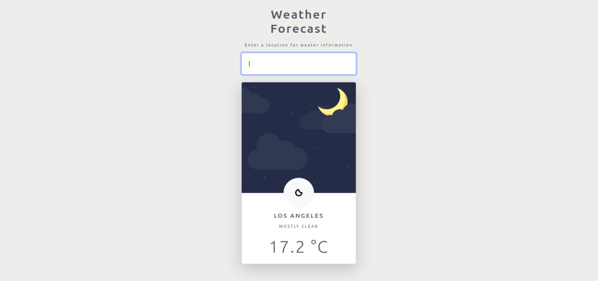

<h1> Weather Forecast App :cloud: </h1>

Simple online application that allows the user to check the weather in a desired location.

<h2> Screenshots </h2>

<h2> Technologies Used </h2>

- JavaScript
  <a href="https://developer.mozilla.org/ru/docs/Learn/Getting_started_with_the_web/CSS_basics" target="_blank" rel="noreferrer"> &nbsp;  </a>

- HTML5
  <a href="https://developer.mozilla.org/ru/docs/Web/HTML" target="_blank" rel="noreferrer"> &nbsp;  </a>

- CSS3
  <a href="https://developer.mozilla.org/ru/docs/Web/JavaScript" target="_blank" rel="noreferrer"> &nbsp;  </a>

- Git
  <a href="https://git-scm.com/" target="_blank" rel="noreferrer"> &nbsp;  </a>

- Bootstrap
  <a href="https://getbootstrap.com/" target="\_blank" rel="noreferrer"> &nbsp;  </a>

<h2> Badges </h2>

&nbsp;

&nbsp;

<h3> Acknowledgements </h3>

- Thanks to the [Net Ninja](https://netninja.dev/) for unsurpassed tutorials!
- Weather forecast is created with the help of [Accu Weather APIs](https://developer.accuweather.com/)
- Simple but splendid weather icons by [Adam Whitcroft](https://adamwhitcroft.com/)
